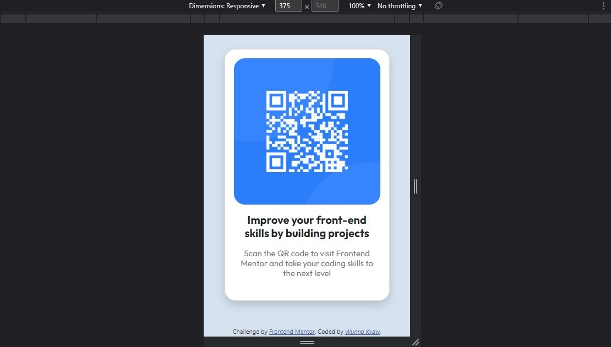
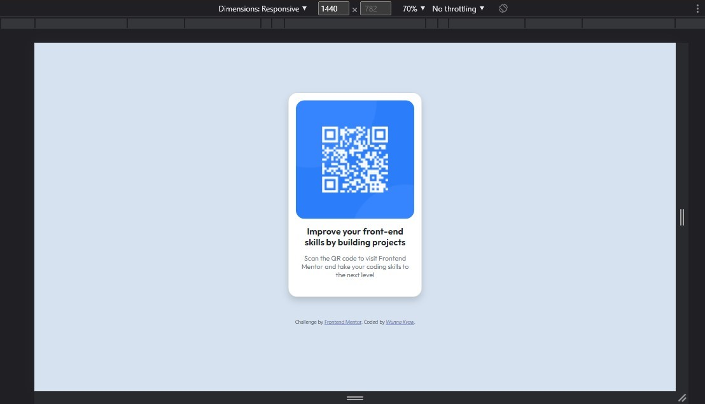

# Frontend Mentor - QR code component solution

This is a solution to the [QR code component challenge on Frontend Mentor](https://www.frontendmentor.io/challenges/qr-code-component-iux_sIO_H). Frontend Mentor challenges help you improve your coding skills by building realistic projects. 

## Table of contents

- [Overview](#overview)
  - [Screenshot](#screenshot)
  - [Links](#links)
- [My process](#my-process)
  - [Built with](#built-with)
  - [What I learned](#what-i-learned)
  - [Continued development](#continued-development)
  - [Useful resources](#useful-resources)
- [Author](#author)
- [Acknowledgments](#acknowledgments)

## Overview

### Screenshot
Screenshot for Mobile (375px)

Screenshot for Desktop (1440px)

### Links

- Solution URL: [Github](https://github.com/HeronKyaw/qr-code-component)
- Live Site URL: [Github pages](https://heronkyaw.github.io/qr-code-component/)

## My process

### Built with

- Semantic HTML5 markup
- CSS custom properties
- Flexbox (included in bootstrap components)
- Bootstrap
- Mobile-first workflow

### What I learned

During this project, I have been practising Bootstrap 5. However, sometimes, it is better to use pure css even though I can customize the value in Bootstrap 5. Bootstrap 5 is just an amazing css framework.  

### Continued development

In the next projects, I will try to customize the Bootstrap css files instead of using the pure css on my own. As I still feel that my responsive skill is not satisfied for me. I will learn to make the best responsive layout for every devices.

### Useful resources

- [Resource 1](https://getbootstrap.com/) - This is the only framework that I use in this project. This helps me a lot to create layout.

## Author

- Frontend Mentor - [@HeronKyaw](https://www.frontendmentor.io/profile/HeronKyaw)
- Linkedin - (https://www.linkedin.com/in/wunnakyaw11/)
- Github - (https://github.com/HeronKyaw)

## Acknowledgments

I did this project on my own. However, thanks to frontend mentor for letting us practise. Thanks a million. One of the best website for frontend developer.